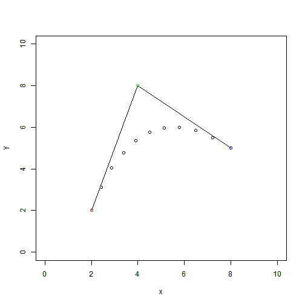

Bezier Curve: 3D Printing
==============================================
author: me
date: Sun Dec 14 19:13:26 2014

Bezier formula
==============================================

### Synopsis:

    The Bezier curve has many applications including computer fonts and graphics. In 3D printing it is somtimes desirable to reproduce these curves. The curve must be converted to
g codes that the printers understand. This requires breaking the curve up into a series of arcs of circles. Since the printer knows its starting position it is only necessary to give the end point and radius of the arc. For instance if an arc ended at (3,3) with a 1 inch radius one could give the command "g02 x3 y3 r1" in the text file sent to the printer. The printer continues extruding plastic layer by layer in straight lines and arcs until the object is completed.

Bezier Formula:
B(t)=(1-t) [(1-t)P0+tP1]+t [(1-t)P1+tP2]

build data
==============


```r
setwd("~/R/coursera/devdataprod-016/bezier")
p0=c(2,2);p1=c(4,8);p2=c(8,5);t=0
bt0=function(t){(1-t)*((1-t)*p0+t*p1)+
                   t *((1-t)*p1+t*p2)}
bt1=function(t){(1-t)^2*p0+2*(1-t)*t*p1+t^2*p2}
bt2=function(t){(1-t)*(p1-p2)+2*t*(p2-p1)}
npt=function(t){vbt0<<-bt0(t)
                vbt1<<-bt1(t);vbt2<<-bt2(t)}
npt(t)
horiz=seq(0,1,.1)
bcurve=data.frame(x=0,y=0)
for(i in seq_along(horiz)){bcurve[i,1]=bt0(horiz[i])[1];bcurve[i,2]=bt0(horiz[i])[2]}
```

plot pts
============
 


Slide With Code
==========================================

```r
summary(cars)
```

```
     speed           dist    
 Min.   : 4.0   Min.   :  2  
 1st Qu.:12.0   1st Qu.: 26  
 Median :15.0   Median : 36  
 Mean   :15.4   Mean   : 43  
 3rd Qu.:19.0   3rd Qu.: 56  
 Max.   :25.0   Max.   :120  
```

Slide With Plot
=============================================

 

more slides
=================
here is move text
# $x^2$
# $x^{234}    y_{abc}$

# $\sqrt{a*b*c}$

