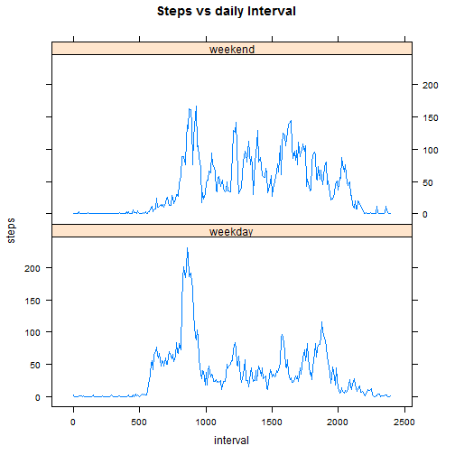

1. Read data & print histogram


```r
# setwd("~/R/coursera/repdata-006/peerAssesments/peer1")
# https://github.com/rdpeng/RepData_PeerAssessment1
act.na=read.csv("./figure/activity.csv")
act=na.omit(act.na)
uday=unique(as.character(act[,2]))
pday=data.frame(sum=0,mean=0,median=0,date=as.Date("2012-10-01"))
for(ii in 1:53){pday[ii,1]=sum   (act[act[,2]==uday[ii],1]);
                pday[ii,2]=            as.Date(uday[ii])}
                  
hist(pday[,1],main="Frequency vs Steps/day",xlab="Steps per day")
```

 

2. The mean number of steps is: 1.0766 &times; 10<sup>4</sup>
   The median number of steps is: 1.0765 &times; 10<sup>4</sup>


3. plot time series 5-minute intervals

```r
df=data.frame(steps=act[,1],interval=act[,3])
intervals <- aggregate(steps~interval,data=df,mean)
intervals[,1] <- (intervals[,1]%/%100+(intervals[,1]%%100)/60)*100
plot(intervals$interval,intervals$steps,type="l",
      main="Average Steps vs Intervals",
      xlab="interval",ylab="average steps")
```

 

4. The maximum 5-min step interval is: 858.3333.

5. The number of missing data are: 2304.

6. The strategy is to use the intervals averages for missing rows.

7. make new data set and fill missing values

```r
my_sdiff=setdiff(act.na[,2],act[,2])
af=act.na; intervals[,1]=af[1:288,3]
for(na.date in my_sdiff){
  for(int_val in act[1:288,3]){
    af[af[,2]==na.date&af[,3]==int_val,1] = intervals[intervals[,1]==int_val,2]
  }}
```
8. make histogram with new filled data set

```r
uday2  =unique(as.character(af[,2]))
pday2  =data.frame(sum=0,date=as.Date("2012-10-01"))
for(ii in 1:61){pday2[ii,1]=sum   (act[act[,2]==uday2[ii],1]);
                pday2[ii,2]=            as.Date(uday2[ii])}

hist(pday2[,1],main="Frequency vs Steps/day filled array",xlab="Steps per day")
```

 

9. impact of missing data?

The difference in means 1411.9592

The difference in meadians 370

10. make weekday and weekend column

```r
xday=as.character(af[,2])
xday=ifelse(is.element(weekdays(as.POSIXct(xday)),c("Saturday","Sunday")),"weekend","weekday")
af=cbind(af,xday)
```
11. Make interval means and plots.

```r
imeans =aggregate(steps~interval+xday,data=af,mean)
imeans[,1] <- (imeans[,1]%/%100+(imeans[,1]%%100)/60)*100

library(lattice)
xyplot(steps ~ interval|xday, data=imeans,layout=c(1,2),type="l",main="Steps vs daily Interval")
```

 


